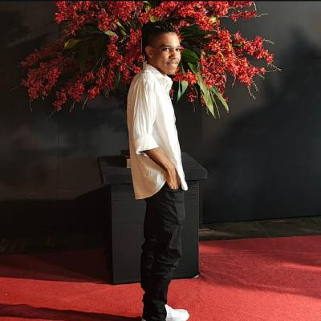

# 🚀 Portfólio de Éder Junior - Desenvolvedor Web

Um portfólio moderno e responsivo que apresenta meu trabalho como desenvolvedor front-end, com design elegante e interações fluidas.



## ✨ Recursos Principais

- **Design Profissional**: Interface limpa com esquema de cores azul (#0B60FF) e preto
- **Totalmente Responsivo**: Adapta-se perfeitamente de smartphones a telas 4K
- **Animação de Digitação**: Efeito dinâmico no subtítulo
- **Seção de Projetos**: Destaque para trabalhos como:
  - 🕷️ Spider-Man Multiversos (experiência web interativa)
  - 🌌 Mundo Invertido (landing page temática)
  - ⚡ Pokedex Web (consumindo PokeAPI)
- **Visualização de Habilidades**: Ícones das tecnologias que domino
- **Efeitos Modernos**:
  - Hover suaves em todos os elementos interativos
  - Loader animado no carregamento
  - Botão "voltar ao topo" inteligente
  - Scrollbar personalizada

## 🛠️ Tecnologias Utilizadas

- HTML5 Semântico
- CSS3 Avançado (Flexbox, Grid, Variáveis CSS)
- JavaScript Puro (DOM Manipulation, Event Listeners)
- Design Responsivo (Mobile-first + breakpoints para todas as telas)

## 📚 Estrutura

```bash
portfolio/
├── index.html          # Página principal
├── css/
│   └── style.css       # Estilos completos com responsividade
├── js/
│   └── script.js       # Lógica das interações
├── img/                # Todas as imagens organizadas
│   ├── Profile/
│   ├── Projetos/
│   ├── Habilidades/
│   ├── Redes-Sociais/
│   └── icone/
└── README.md           # Este arquivo
```

## 🌐 Como Visualizar

1. Acesse online: [GitHub Pages](https://ederjuniors.github.io/portfolio)
2. Ou clone o repositório:
```bash
git clone https://github.com/EderJuniorS/portfolio.git
cd portfolio
```

## 📌 Próximos Passos

- Adicionar mais projetos conforme desenvolvidos
- Implementar modo dark/light
- Adicionar seção de blog técnico

---

💡 **Sobre o Autor**: Estudante de Ciência da Computação na Unifran, técnico em Desenvolvimento de Sistemas pela ETEC, apaixonado por criar experiências web criativas e eficientes.

🔗 **Links Úteis**:
- [LinkedIn](https://www.linkedin.com/in/ederjuniormatossilva)
- [Todos os Projetos](https://github.com/EderJuniorS?tab=repositories)

---

Esta descrição:
1. Destaque seus melhores projetos
2. Mostra suas habilidades técnicas
3. Inclui preview visual
4. Tem estrutura clara para navegação
5. Mostra personalidade e objetivos

Você pode adicionar esta descrição no arquivo README.md do seu repositório no GitHub! 😊
